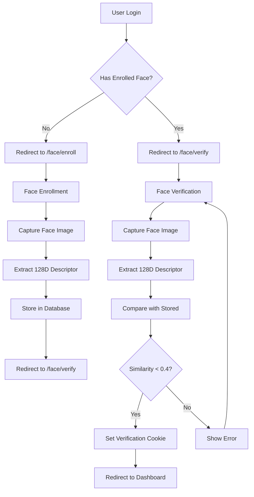
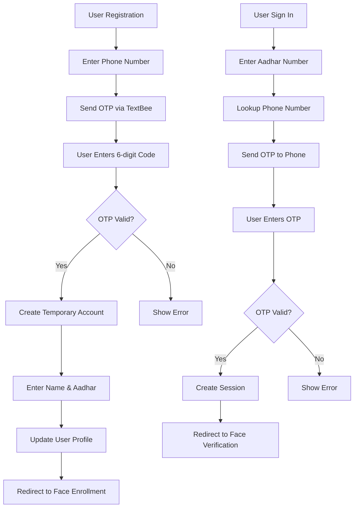
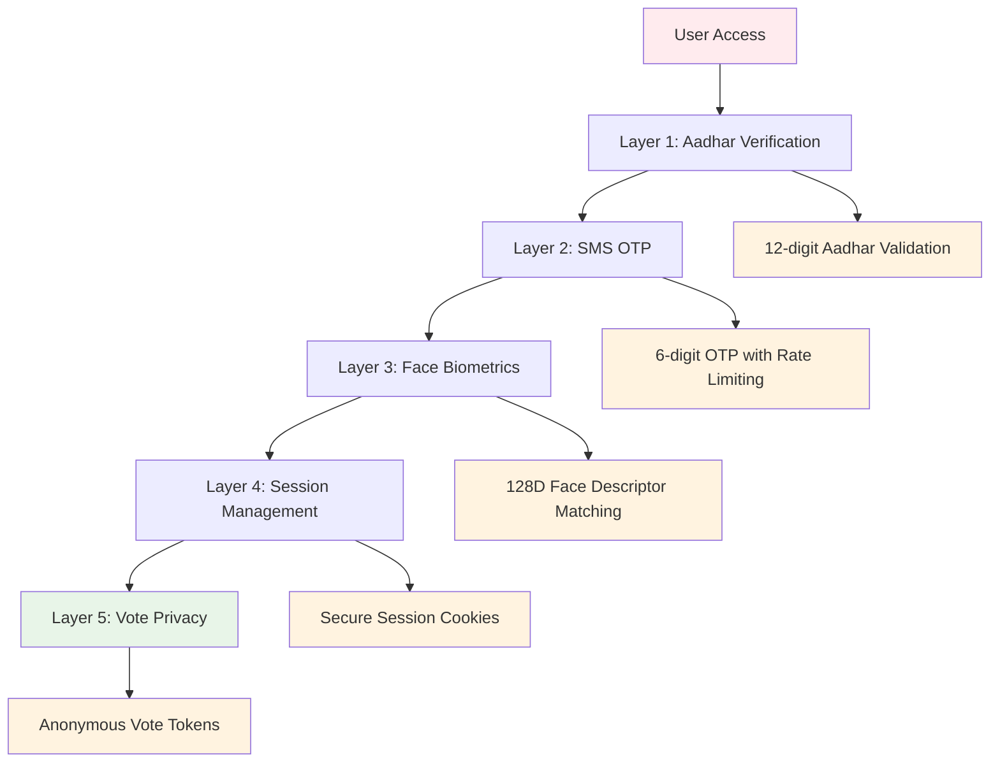
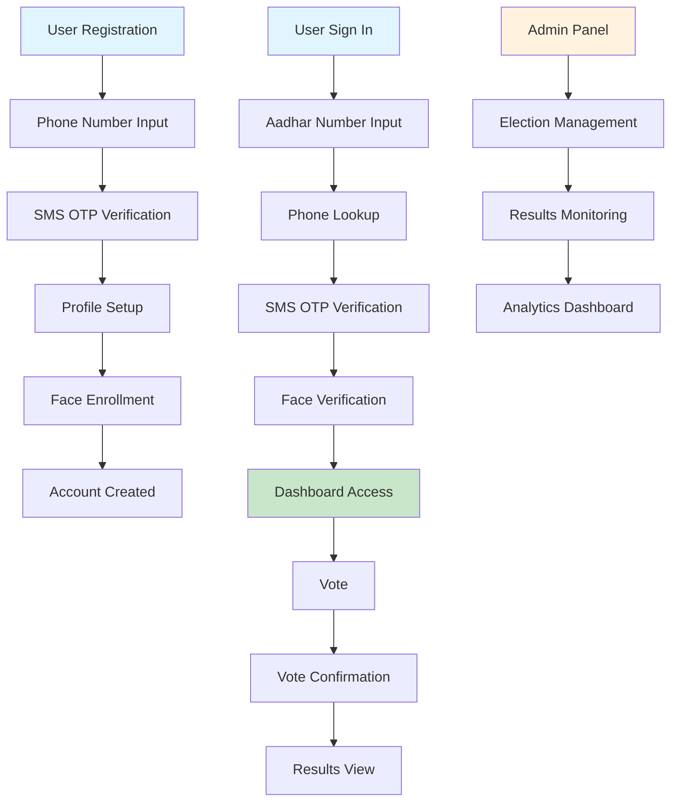

# 🗳️ BVS - Biometric Voting System

A modern, secure, and accessible digital voting platform built with Next.js 15, featuring biometric authentication, real-time results, and comprehensive election management.

<div align="center">
  
  
  
</div>

## 🌟 Overview

**BVS (Biometric Voting System)** is a cutting-edge digital voting platform that revolutionizes the electoral process through secure biometric authentication, real-time result tracking, and comprehensive election management. Built with modern web technologies, it ensures transparency, security, and accessibility in democratic elections.

### ✨ Key Features

- 🔐 **Biometric Authentication** - Face recognition for secure voter verification
- 🗳️ **Digital Voting** - Secure online voting with privacy protection
- 📊 **Real-time Results** - Live election result tracking and analytics
- 👥 **Multi-constituency Support** - Manage elections across different regions
- 🔒 **Vote Privacy** - Anonymous voting with verification tokens
- 📱 **Responsive Design** - Works perfectly on all devices
- 🎯 **TypeScript** - Full type safety throughout
- 🎨 **Modern UI** - Beautiful interface with shadcn/ui components
- 📧 **Email Integration** - Password reset and verification emails
- 📱 **SMS Verification** - Phone number verification for additional security

## 🚀 Quick Start

### Prerequisites

- Node.js 18+ 
- bun, yarn, or pnpm
- Webcam for biometric authentication

### 1. Clone and Install

```bash
git clone https://github.com/your-username/biometric-voting-system.git
cd biometric-voting-system
bun install
```

### 2. Environment Setup

```bash
cp .env.example .env
```

Update `.env` with your configuration:
```env
# Database (relative to prisma/schema.prisma)
DATABASE_URL="file:./local.db"

# Public app URL (no trailing slash)
# Dev:
NEXT_PUBLIC_APP_URL="http://localhost:3000"

# Generate by running openssl rand -base64 32 or bun x @better-auth/cli secret
BETTER_AUTH_SECRET=

SMS_API_KEY=
DEVICE_ID=
```

### 3. Database Setup

```bash
# Generate Prisma client
bun run prisma:generate

# Push schema to database
bun run db:push

# Seed initial data (optional)
bun run seed
```

### 4. Start Development

```bash
bun dev
```

Open [http://localhost:3000](http://localhost:3000) in your browser.

## 🏗️ Project Structure

```
src/
├── app/
│   ├── auth/
│   │   ├── page.tsx              # Authentication page
│   │   └── action.ts             # Auth server actions
│   ├── dashboard/
│   │   ├── page.tsx              # User dashboard
│   │   ├── actions.ts            # Dashboard actions
│   │   └── upload/
│   │       └── route.ts          # File upload endpoint
│   ├── face/
│   │   ├── action.ts             # Face verification actions
│   │   ├── enroll/
│   │   │   └── page.tsx          # Face enrollment page
│   │   └── verify/
│   │       └── page.tsx          # Face verification page
│   ├── voting/
│   │   └── action.ts             # Voting system actions
│   ├── admin/
│   │   └── results/
│   │       └── page.tsx          # Election results page
│   ├── forgot-password/
│   │   └── page.tsx              # Password reset request
│   ├── reset-password/
│   │   └── page.tsx              # Password reset form
│   ├── api/auth/[...all]/
│   │   └── route.ts              # Better Auth API routes
│   ├── globals.css               # Global styles & Tailwind
│   ├── layout.tsx                # Root layout
│   └── page.tsx                  # Home page
├── components/
│   ├── auth-client.tsx           # Auth UI with tabs
│   ├── sign-in.tsx               # Sign in form
│   ├── sign-up.tsx               # Sign up form
│   ├── avatar-uploader.tsx       # Profile picture upload
│   ├── delete-account-dialog.tsx # Account deletion dialog
│   ├── evm-client.tsx            # Electronic voting machine client
│   ├── results-client.tsx        # Results display client
│   ├── face/
│   │   ├── FaceCamera.tsx        # Camera component
│   │   ├── FaceEnrollClient.tsx  # Face enrollment UI
│   │   ├── FaceVerifyClient.tsx  # Face verification UI
│   │   └── faceApi.ts            # Face API utilities
│   └── ui/                       # shadcn/ui components
├── lib/
│   ├── auth.ts                   # Better Auth configuration
│   ├── auth-client.ts            # Client-side auth utilities
│   ├── action-helpers.ts         # Server action utilities
│   ├── constants.ts              # Application constants
│   ├── types.ts                  # TypeScript types
│   ├── prisma.ts                 # Prisma client
│   ├── utils.ts                  # Utility functions
│   ├── textbee.ts                # SMS integration
│   └── seed.ts                   # Database seeding
└── generated/
    └── prisma/                   # Generated Prisma client
```

## 🗳️ Core Features Deep Dive

### 🔐 Biometric Authentication

The system uses advanced face recognition technology for secure voter verification:

- **Face Enrollment**: Users register their face during sign-up
- **Face Verification**: Real-time face matching during login
- **Session Management**: Secure session-based verification
- **Privacy Protection**: Face descriptors stored securely

### Face Recognition Architecture

```typescript
// Face verification configuration
FACE_VERIFICATION = {
  EUCLIDEAN_THRESHOLD: 0.4,    // Distance threshold for verification
  COOKIE_NAME: "fv",           // Session verification cookie
  COOKIE_MAX_AGE: 60 * 30,     // 30 minutes validity
}

// Face detection configuration
FACE_DETECTION = {
  INPUT_SIZE: 224,             // Face detection input size
  SCORE_THRESHOLD: 0.7,        // Face detection confidence
  DESCRIPTOR_LENGTH: 128,      // Face descriptor dimensions
}
```

### Face Verification Flow



### Technical Implementation

**Face Detection Process:**
1. **Model Loading**: Dynamically loads face-api.js models from `/public/models/`
2. **Video Capture**: Uses HTML5 video element with getUserMedia API
3. **Face Detection**: TinyFaceDetector with 224px input size and 0.7 confidence threshold
4. **Landmark Extraction**: 68-point facial landmark detection
5. **Descriptor Generation**: 128-dimensional face descriptor using deep learning

**Security Features:**
- **Euclidean Distance**: Mathematical comparison of face descriptors
- **Session-Scoped Cookies**: Verification tied to specific session ID
- **Server-Side Processing**: All verification logic on server for security
- **Configurable Thresholds**: Adjustable similarity thresholds for accuracy vs security

**Database Storage:**
```sql
-- Face verification fields in User model
faceDescriptor   String?   -- JSON stringified 128-dimensional descriptor
lastFaceVerified DateTime? -- Timestamp of last successful verification
```

## 📱 SMS Verification & Phone OTP

The system implements a comprehensive SMS-based authentication system using TextBee API for secure voter verification.

### Phone OTP Architecture

```typescript
// TextBee SMS Service Configuration
interface TextBeeConfig {
  apiKey: string;        // SMS_API_KEY from environment
  deviceId: string;      // DEVICE_ID from environment
  baseUrl?: string;      // Default: https://api.textbee.dev
}

// Better Auth Phone Plugin Configuration
phoneNumber({
  sendOTP: async ({ phoneNumber, code }) => {
    const result = await textbeeService.sendOTP(phoneNumber, code);
    if (!result.success) {
      throw new Error(`Failed to send OTP: ${result.error}`);
    }
  },
  otpLength: 6,                    // 6-digit OTP codes
  expiresIn: 300,                  // 5 minutes expiration
  allowedAttempts: 3,              // Maximum verification attempts
  requireVerification: true,       // Mandatory phone verification
})
```

### Authentication Flow



### Technical Implementation

**TextBee Integration:**
- **API Endpoint**: `https://api.textbee.dev/api/v1/gateway/devices/{deviceId}/send-sms`
- **Authentication**: API key-based authentication
- **Message Format**: "Your verification code is: {code}. This code will expire in 5 minutes."
- **Error Handling**: Comprehensive error handling with detailed error messages

**Security Features:**
- **Rate Limiting**: 3 attempts per OTP with automatic blocking
- **Time-based Expiration**: 5-minute OTP validity
- **Session Management**: Secure session creation after successful verification
- **Aadhar Integration**: Phone numbers linked to Aadhar for identity verification

**Database Schema:**
```sql
-- Phone verification fields in User model
phoneNumber        String?  @unique
phoneNumberVerified Boolean @default(false)
aadharNumber       String?  @unique
```

### Sign-up Process

1. **Phone Verification**: User enters phone number → receives 6-digit OTP
2. **OTP Verification**: User enters OTP → account created with temporary email
3. **Profile Completion**: User provides name and Aadhar number
4. **Face Enrollment**: Redirected to face enrollment for biometric setup

### Sign-in Process

1. **Aadhar Lookup**: User enters 12-digit Aadhar number
2. **Phone Retrieval**: System looks up associated phone number
3. **OTP Delivery**: 6-digit OTP sent to registered phone number
4. **Verification**: User enters OTP → session created
5. **Face Verification**: Redirected to face verification for biometric check

### 🗳️ Digital Voting System

Secure and transparent voting with privacy protection:

- **Anonymous Voting**: Votes are linked to tokens, not user identities
- **Constituency Management**: Support for multiple electoral regions
- **Candidate Management**: Complete candidate profiles with party information
- **Vote Verification**: Users can verify their vote using unique tokens

### 📊 Election Management

Comprehensive tools for election administrators:

- **Real-time Results**: Live tracking of election progress
- **Constituency Analytics**: Detailed voting statistics by region
- **Candidate Performance**: Individual candidate vote tracking
- **Voter Turnout**: Real-time voter participation metrics

### 🔒 Security Architecture

The BVS system implements a multi-layered security approach combining biometric authentication, SMS verification, and cryptographic protection.

#### Security Layers



#### Security Features

**🔐 Multi-Factor Authentication:**
- **Aadhar Verification**: 12-digit unique identity validation
- **SMS OTP**: 6-digit time-limited codes with 3-attempt limit
- **Face Biometrics**: 128-dimensional descriptor matching with 0.4 threshold
- **Session Management**: Secure HTTP-only cookies with 30-minute face verification

**🛡️ Data Protection:**
- **Vote Privacy**: Anonymous voting with unique verification tokens
- **Face Data**: Encrypted 128D descriptors stored securely
- **Session Security**: CSRF-protected sessions with automatic expiration
- **Input Validation**: Zod schema validation for all user inputs

**🔒 API Security:**
- **Rate Limiting**: Configurable limits on OTP and authentication attempts
- **Error Handling**: Secure error messages without information leakage
- **HTTPS Enforcement**: All communications encrypted in production
- **Type Safety**: Full TypeScript coverage preventing runtime errors

#### Security Configuration

```typescript
// Face Verification Security
FACE_VERIFICATION = {
  EUCLIDEAN_THRESHOLD: 0.4,    // Balance between security and usability
  COOKIE_NAME: "fv",           // Session-scoped verification
  COOKIE_MAX_AGE: 60 * 30,     // 30-minute verification window
}

// SMS Security
SMS_CONFIG = {
  OTP_LENGTH: 6,               // 6-digit codes
  EXPIRES_IN: 300,             // 5-minute validity
  MAX_ATTEMPTS: 3,             // Rate limiting
  MESSAGE_TEMPLATE: "Your verification code is: {code}. This code will expire in 5 minutes."
}

// Session Security
SESSION_CONFIG = {
  EXPIRES_IN: 60 * 60 * 24 * 7, // 7-day sessions
  HTTP_ONLY: true,             // XSS protection
  SAME_SITE: "lax",            // CSRF protection
  SECURE: true                 // HTTPS only in production
}
```

## 🛠️ Tech Stack

| Technology           | Purpose                 | Version |
| -------------------- | ----------------------- | ------- |
| **Next.js**          | Full-stack Framework    | 15.4.6  |
| **React**            | Frontend Framework      | 19.1.1  |
| **TypeScript**       | Type Safety             | 5.9.2   |
| **Prisma**           | Database ORM            | 6.14.0  |
| **Better Auth**      | Authentication          | 1.3.6   |
| **Face-api.js**      | Biometric Recognition   | 1.7.15  |
| **Tailwind CSS**     | Styling & UI            | 4.1.12  |
| **shadcn/ui**        | UI Components           | Latest  |
| **SQLite**           | Database (Dev)          | -       |
| **Zod**              | Schema Validation       | 4.0.17  |

## 🗄️ Database Schema

The system uses a comprehensive database schema supporting:

### Core Models

- **User**: Voter profiles with biometric data
- **Session**: Authentication sessions
- **Account**: OAuth and credential accounts
- **Verification**: Email/SMS verification tokens

### Voting Models

- **Constituency**: Electoral regions
- **Candidate**: Election candidates with party information
- **Vote**: Anonymous votes linked to verification tokens

```sql
-- Example: Vote privacy protection
model Vote {
  id            String    @id @default(uuid())
  voteToken     String    @unique // Links to user's vote token
  candidateId   String
  constituencyId String
  createdAt     DateTime  @default(now())
  
  // No direct link to user - maintains vote privacy
}
```

## 🚀 Deployment

### Environment Variables

Set these in your production environment:

```env
# Database (use PostgreSQL for production)
DATABASE_URL="your-production-database-url"

# Public app URL (no trailing slash)
NEXT_PUBLIC_APP_URL="https://your-domain.com"

# Generate by running openssl rand -base64 32 or bun x @better-auth/cli secret
BETTER_AUTH_SECRET="your-secret-key"

# SMS configuration
SMS_API_KEY="your_sms_api_key"
DEVICE_ID="your_device_id"
```

### Database Migration

For production, consider using PostgreSQL:

1. Update `prisma/schema.prisma`:
```prisma
datasource db {
  provider = "postgresql"
  url      = env("DATABASE_URL")
}
```

2. Deploy your database and run migrations:
```bash
npx prisma migrate deploy
```

### Deployment Platforms

This system works with all major deployment platforms:

- **Vercel** - Recommended for Next.js apps
- **Railway** - Easy database + app deployment
- **Render** - Simple deployment with PostgreSQL
- **AWS/GCP/Azure** - Enterprise deployments

## 🛠️ Development

### Available Scripts

```bash
bun dev              # Start development server
bun run build        # Build for production
bun run start        # Start production server
bun run typecheck    # TypeScript type checking
bun run format       # Code formatting
bun run prisma:generate  # Generate Prisma client
bun run db:push      # Push schema to database
bun run seed         # Seed database with sample data
```

### Adding New Features

1. **New Pages**: Add to `src/app/` following the existing pattern
2. **Components**: Create in `src/components/` with proper TypeScript
3. **Server Actions**: Use the `validatedAction` helper in `src/lib/action-helpers.ts`
4. **Database**: Add models to `prisma/schema.prisma`

## 📱 Face Recognition Setup

### Model Requirements

The system requires face-api.js models for biometric authentication. Download these models to `public/models/`:

**Required Models:**
- `tiny_face_detector_model-weights_manifest.json` - Face detection model manifest
- `tiny_face_detector_model.bin` - Face detection model weights
- `face_landmark_68_model-weights_manifest.json` - Facial landmarks model manifest
- `face_landmark_68_model.bin` - 68-point facial landmark detection
- `face_recognition_model-weights_manifest.json` - Face recognition model manifest
- `face_recognition_model.bin` - 128D face descriptor extraction

### Model Download

```bash
# Create models directory
mkdir -p public/models

# Download models (you can get these from face-api.js repository)
# or use the models already included in the project
```

### Configuration

```typescript
// Face detection settings
FACE_DETECTION = {
  INPUT_SIZE: 224,             // Face detection input size
  SCORE_THRESHOLD: 0.7,        // Face detection confidence (0.0-1.0)
  DESCRIPTOR_LENGTH: 128,      // Face descriptor dimensions
}

// Face verification settings
FACE_VERIFICATION = {
  EUCLIDEAN_THRESHOLD: 0.4,    // Similarity threshold (lower = stricter)
  COOKIE_NAME: "fv",           // Session verification cookie name
  COOKIE_MAX_AGE: 60 * 30,     // 30 minutes verification validity
}
```

### Troubleshooting

**Common Issues:**
- **Video not playing**: Ensure HTTPS in production (camera requires secure context)
- **Face not detected**: Check lighting and camera positioning
- **False positives/negatives**: Adjust `EUCLIDEAN_THRESHOLD` in constants
- **Model loading errors**: Verify models are in `public/models/` directory
- **Performance issues**: Consider reducing `INPUT_SIZE` for faster detection

**Performance Optimization:**
- **Detection Speed**: Lower `INPUT_SIZE` (e.g., 160) for faster processing
- **Accuracy**: Higher `SCORE_THRESHOLD` (e.g., 0.8) for more confident detection
- **Security**: Lower `EUCLIDEAN_THRESHOLD` (e.g., 0.3) for stricter matching

## 🔄 Application Flow



## 🤝 Contributing

1. Fork the repository
2. Create a feature branch (`git checkout -b feature/amazing-feature`)
3. Commit your changes (`git commit -m 'Add amazing feature'`)
4. Push to the branch (`git push origin feature/amazing-feature`)
5. Open a Pull Request

## 📄 License

This project is licensed under the MIT License - see the [LICENSE](LICENSE) file for details.

## 🙏 Acknowledgments

- [Next.js](https://nextjs.org) - The React framework
- [Better Auth](https://better-auth.com) - Authentication library
- [Prisma](https://prisma.io) - Database toolkit
- [Face-api.js](https://github.com/vladmandic/face-api) - Face recognition library
- [shadcn/ui](https://ui.shadcn.com) - UI components
- [Tailwind CSS](https://tailwindcss.com) - CSS framework

---

**Empowering Democracy Through Technology** 🗳️

BVS provides a secure, transparent, and accessible platform for modern digital elections. Built with cutting-edge technology and a focus on user experience, it's ready to revolutionize the electoral process.

⭐ Star this repo | 🐛 Report Bug | 💡 Request Feature
